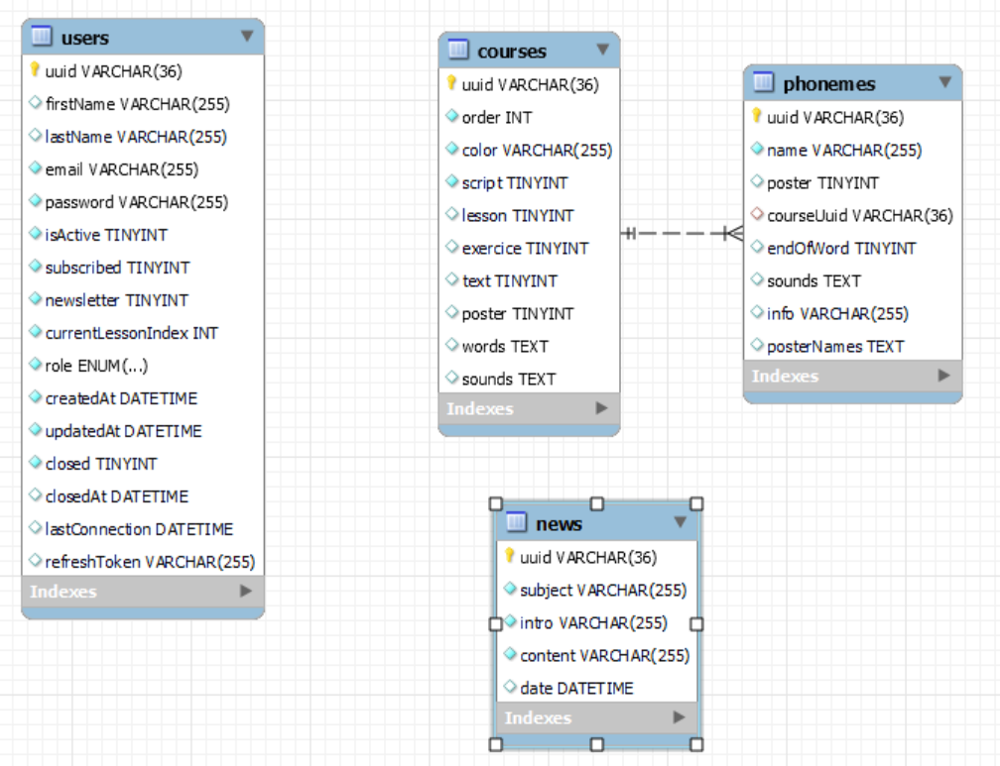

# La Méthode Claire 👓

> "La méthode claire" est une méthode d'apprentissage de la lecture destinée aux professeurs des écoles, notamment en CP. Cet espace contient l'ensemble du code nécessaire au fonctionnement de l'API.

## Get started 💪

``` bash
npm i # Install workspace dependency
npm run start # Launch API (with watcher for file changes)
npm run build # Build distributable folder
npm run test # Launch jest testing suite
```

## Fonctionnalités 🎉

Retrouvez l'ensemble des resources disponibles sur la [documentation Swagger](https://lmc.louiiuol.dev/api#/).

### 1. Authentification

> Gestion de l'authentification des utilisateurs, de leurs permissions, et de leurs informations stockées.

- [x] Création d'un compte (unique par l'email)
  - [x] Validation du compte par l'envoi d'un lien à l'adresse email renseignée (valide pendant 15 minutes).
  - [x] Demander le renvoi d'un code de validation de compte si celui-ci à expiré.

- [x] Authentification des utilisateurs, signée par des tokens JWT
  - [x] Mécanisme de token de rafraîchissement

- [x] Gestion des informations de l'utilisateur
  - [x] éditer ses propres informations (nom, adresse email etc.)
  - [x] Vérifier et éditer son mot de passe

- [x] "Mot de passe oublié" envoi d'un email contenant lien et un token pour éditer le mot de passe du compte associé (valide pendant 10 minutes)

- [x] Fermeture de compte
- [x] CRON permettant de vérifier les comptes fermés depuis:
    - 1 mois (envoi d'un email avertissement)
    - 2 mois (suppression du compte)

### 2. Bibliothèque

> La bibliothèque représente l'ensemble des leçons d'une année scolaire, découpé en semaines. Chacune d'entre elle est unique: certaines semaines comporte plusieurs affiches, d'autres non..Une automatisation est nécessaire, car la méthode évolue !

- [x] Récupération de l'ensemble des lessons disponible (en base de donnée)
- [x] Routes dynamiques permettant l'affichage (octet-stream) ou le téléchargement (.pdf) des différentes leçons
- [x] Système de progression (stockage de l'index de la leçon courante dans l'entité User)

### 3. Back office

> Ressources dédiées au administrateur de l'application. Chaque fonctionnalités qui suit est donc protégé par un token d'admin (l'utilisateur doit avoir un rôle égal à 'ADMIN').

- [x] Administration des utilisateurs
  - [x] Affichages des utilisateurs de la page, avec pagination, tri, et filtres avancés (email:like:email@example.fr)
  - [x] Activation et désactivation manuel des utilisateurs et de leurs abonnement.

- [ ] Administration de la bibliothèque
  - [x] Génération et rafraîchissement de la bibliothèque à partir d'un fichier json décrivant les propriétés de chaque leçons.
  - [ ] Resource dynamique permettant de remplacer des leçons avec un nouveau fichier donné en input.

- [x] Réinitialiser les abonnements

- [x] Newsletter: envoi d'un email à l'ensemble des utilisateurs abonnés à la newsletter. Les utilisateurs qui sont également abonnés à la méthode verront du contenu supplémentaire.

### 4. Paiement & Paiement (In progress)

> Chaque utilisateur peut s'abonner pour accéder à l'ensemble du contenu. Un abonnement est valable pour une année scolaire.

- [ ] Intégration d'un système de paiement via Stripe
- [ ] Lorsque le paiement est validé:
  - [ ] Activation de l'abonnement de l'utilisateur
  - [ ] Génération et stockage d'une facture
- [ ] Ressource permettant de "récupérer ma facture"
- [ ] En début d'année scolaire, chaque abonnement doit être réinitialisé

## Sources

- [NestJS](https://docs.nestjs.com/v5/)
- [AutoMapper](https://automapperts.netlify.app/docs/nestjs)
- [TypeORM](https://orkhan.gitbook.io/typeorm/docs)
- [NodeMailer](https://www.nodemailer.com/about/#example)

### Class Validators

- [Usage](https://github.com/typestack/class-validator#usage)
- [Validation decorators](https://github.com/typestack/class-validator#validation-decorators)

## Base de donnée


